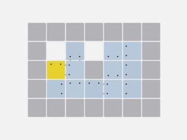

# Ouroboros

## Overview

Ouroboros is a [Sokoban](https://en.wikipedia.org/wiki/Sokoban) + [Snake](https://en.wikipedia.org/wiki/Snake_(video_game_genre)) style puzzle game implemented in F\# using [raylib](https://github.com/raysan5/raylib) and [raylib-cs](https://github.com/raylib-cs/raylib-cs).

The ultimate goal of each level is to form a single [ouroboros](https://en.wikipedia.org/wiki/Ouroboros).

## Download and Play

### The Fastest Way

- Download the appropriate `.zip` file from [Releases](https://github.com/T9Y9/Ouroboros/releases), and extract it.
- Then, you can simply run the `Ouroboros` executable.

### Alternative Way

- Ensure you have [.NET SDK 10](https://learn.microsoft.com/en-us/dotnet/core/install/) installed on your computer.
- Clone or download this repository.
- Navigate to the project directory.
- Use `dotnet run` to run the project.

See [raylib](https://github.com/raysan5/raylib) and [raylib-cs](https://github.com/raylib-cs/raylib-cs) for more help.

## How to Play

### Menu Controls

- WASD/Arrows to navigate
- Space/Enter to play
- Esc to Quit

### In-Game Controls

- WASD/Arrows to move
- Z to undo
- R to restart
- Q to quit

Make a single ouroboros to win a level. For details, see `Ou (revised).pdf`.

## Changes after the Proposal

Three minor changes were made. For details, see `Ou (revised).pdf`.

## LLM Usage

I asked an LLM to suggest appropriate project structures (Domain, Engine, etc.) and to proofread `Ou.pdf`, `Ou (revised).pdf` and `README.md`.

- `Domain.fs`: Lines 82-87
- `Render.fs`: Lines 15-21, 44-54, 106-157
- `State.fs`: Lines 17-45

The LLM was used to generate the above lines of code, which are mostly related to menu rendering. LLM did a good job generating the correct code. I defined new types such as `MenuLevel` and `current`, and modified the code accordingly. Also, I manually added offsets and scales to them when I tried to make the screen resizable.

I tried to use the LLM to generate other parts of the code, but it struggled to understand the game mechanics, producing mostly nonsense code. However, I adopted a small fraction of them with some modification into my project, as listed below.

- `Domain.fs`: Lines 5, 11
- `Engine.fs`: Lines 8-9
- `Render.fs`: Lines 28-30
- `Program.fs`: Lines 16-18

The rest of the code was written by me.